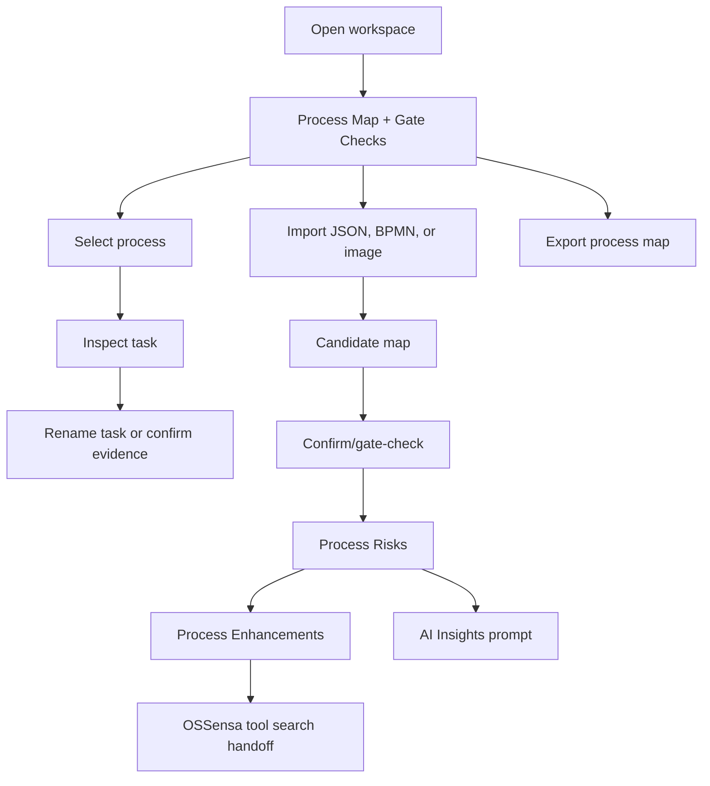

# Design: Operational Context Workspace

> Requirements: @requirements.md
> Status: Approved

## 1. Summary

Rework Flowsensa from an "Observe first" prototype into a map-first operational workspace. The first implementation should reuse the existing local React/Vite architecture and deterministic process engine, while adding lightweight local process metadata, import source handling, task insights, export actions, stronger enhancement language, AI Insights prompting, and provider-agnostic BYOK profiles.

This design intentionally avoids a server, auth, database migration, or universal proprietary LLM adapter layer. The first LLM slice is named OpenAI-compatible profiles.

## 2. Requirements Mapping

| Requirement | Design Coverage |
|-------------|-----------------|
| FR-001 | Sections 3, 4, 8: app default view changes from `overview` to `explorer`; nav removes Observe from core workflow |
| FR-002 | Sections 3, 10: no-data/demo entry uses existing `ImportPanel` with a more visual demo landing |
| FR-003 | Sections 5, 8: add local `ProcessWorkspace` metadata and selector derived from imported collections |
| FR-004 | Sections 5, 8: store process/task display-name overrides separately from source labels |
| FR-005 | Sections 4, 5, 8: extend selected-node details with task insight summaries from telemetry |
| FR-006 | Sections 6, 8, 13: extend import handling for JSON, BPMN XML, and image-assisted extraction |
| FR-007 | Sections 6, 8: expose process-map export from map workspace using existing export functions plus map-specific output |
| FR-008 | Sections 4, 8: rename and strengthen Improvement module into Process Enhancements |
| FR-009 | Sections 6, 8: add OSSensa handoff/search intent actions as local outbound artifacts, not silent external calls |
| FR-010 | Sections 4, 6, 8: AI Insights adds custom prompt input and richer suggested prompts |
| FR-011 | Sections 5, 6, 7: replace `OpenRouterConfig` with `LLMProfile` supporting profile name, base URL, model, key |
| FR-012 | Sections 6, 7, 9: deterministic local behavior remains default; model calls require explicit user action |
| FR-013 | Sections 4, 5, 6, 8: add Process Risks module before Process Enhancements with deterministic and optional LLM-assisted registry rows |

## 3. Technical Approach

Use an incremental frontend-only implementation:

- Change the default workspace view to `explorer`.
- Rename navigation labels without introducing new route machinery.
- Keep the no-data `ImportPanel` as the optional demo landing and restyle it with a grey/purple flow-line visual.
- Add local process metadata on top of current event-derived `ProcessGraph` rather than replacing discovery.
- Extend existing import/export functions for BPMN and process-map exports.
- Add an OpenAI-compatible LLM client that generalizes the existing OpenRouter client.
- Keep keys in React state/session only for this slice.

## 4. Component / Module Structure

```text
App
  ImportPanel                    no-data demo/import entry
  ProcessExplorer                map, selector, rename, task details, map export
  ProcessRisks                   selected-process risk registry and mitigations
  ImprovementOpportunities       renamed Process Enhancements
  AIAnalyst                      renamed AIInsights, prompt input
  SettingsModule                 LLM profiles instead of OpenRouter-only settings

domain
  processMetadata.ts             process/task display names and selectors
  bpmnImport.ts                  BPMN XML to candidate graph/events
  processInsights.ts             task metrics and insight copy
  processRisks.ts                deterministic task/process risk registry
  llmProfiles.ts                 profile validation and request shape
  imageProcessImport.ts          prompt + response parser for model-assisted extraction
  exports.ts                     extend with process-map JSON/Mermaid/Markdown helpers
```

Prefer creating small domain files only when the logic would otherwise bloat `App.tsx` or a module.

## 5. Data Model / State

Add these local types in `src/domain/types.ts` or focused domain files:

```ts
interface LLMProfile {
  id: string;
  name: string;
  apiKey: string;
  baseUrl: string;
  model: string;
}

interface ProcessMetadata {
  id: string;
  displayName: string;
  source: "event-log" | "bpmn" | "image-extracted" | "manual";
  confidence: number;
  taskDisplayNames: Record<string, string>;
  originalTaskLabels: Record<string, string>;
}

interface TaskInsight {
  nodeId: string;
  eventCount: number;
  caseCount: number;
  actorMix: string[];
  medianDurationMs?: number;
  totalDurationMs: number;
  exceptionCount: number;
  retryCount: number;
  reworkSignals: string[];
  upstream: string[];
  downstream: string[];
  evidenceEventIds: string[];
  insufficientTelemetry: string[];
}

interface ProcessRisk {
  id: string;
  processId: string;
  processName: string;
  nodeId: string;
  taskName: string;
  riskIdentified: string;
  riskMitigation: string;
  severity: "low" | "medium" | "high";
  source: "deterministic" | "llm-assisted";
  evidenceEventIds: string[];
}
```

For this slice, support one active event-backed process plus candidate imported process metadata where practical. The selector should still exist and be able to choose among discovered/imported process entries, even if the bundled sample produces one primary process.

Task renaming updates `taskDisplayNames[nodeId]`; original labels remain available in task details and exports.

Process risks are derived from selected process metadata, graph nodes/edges, task insights, gaps, recommendations, and optional LLM profile output. Deterministic risks remain available without a model key.

## 6. API / Integration Contract

### Local Imports

- JSON: existing normalized work-event import remains unchanged.
- BPMN: accept `.bpmn` / `.xml`, parse with `DOMParser`, map BPMN tasks/events/gateways to graph nodes and sequence flows to graph edges. If no telemetry exists, task insights show structure-only and insufficient telemetry notes.
- Image: accept image files and require a selected `LLMProfile`; send a constrained prompt asking for process tasks and transitions in JSON. Parsed output becomes an untrusted candidate requiring confirmation.

### LLM Profiles

Use OpenAI-compatible chat completions:

```text
POST {baseUrl}/chat/completions
Authorization: Bearer {apiKey}
Content-Type: application/json
```

The request body includes `model`, `messages`, and explicit instruction to separate deterministic facts, interpretation, hypotheses, and next checks.

### OSSensa Handoff

Do not silently call OSSensa. Provide a user-triggered action that produces a search query or structured handoff payload for the suggested tool need.

### Process Risks

Deterministic risk generation runs locally and flags risks from:

- exception/retry/rework signals;
- high handoff count or wait time;
- missing owner/authority;
- low graph confidence or unconfirmed task state;
- insufficient telemetry;
- automation candidates that lack controls or failure modes.

When a user explicitly invokes LLM enrichment, send a bounded selected-process context containing process name, task summaries, deterministic risks, and evidence summaries. Returned AI-assisted risks are appended or marked as enriched, never replacing deterministic rows silently.

## 7. Security / Permissions / Privacy

- LLM profiles live in React state/session for this slice; do not persist keys to IndexedDB, local storage, exports, console logs, or source.
- Explicit user action is required for AI Insights prompt submission and image extraction.
- Before sending model context, the UI shows the selected profile and a concise "what gets sent" disclosure.
- Image import must label extraction as AI-assisted and unconfirmed.

## 8. User Flows



## 9. Edge Cases

| Case | Expected Behavior |
|------|-------------------|
| No data | Show concise demo/import landing, not the full workspace |
| One process only | Selector remains visible but simple; rename still works |
| BPMN has structure but no events | Show graph with insufficient telemetry notices |
| Image import without LLM profile | Explain that image extraction needs a configured BYOK profile |
| LLM profile missing base URL/model/key | Disable model call and show setup guidance |
| Invalid BPMN or image extraction JSON | Preserve current workspace and show recoverable error |
| Renamed task later receives new import | Preserve rename when node identity matches; otherwise show original labels |
| Export before confirmation | Include confidence/trust state and unconfirmed warning |
| No risk signals | Show a clear low-risk/insufficient-evidence state rather than empty UI |
| LLM risk enrichment unavailable | Keep deterministic risks visible and explain that deeper risk insight needs a configured LLM profile |

## 10. Accessibility / UX Notes

- Process selector, rename controls, import actions, export menu, and prompt input must be keyboard operable.
- Avoid oversized explanatory copy inside the app workspace.
- Use "Process Map", "Gate Checks", "Process Enhancements", and "AI Insights" as product language.
- Place "Process Risks" before "Process Enhancements" in sidebar, mobile More sheet, and any tab sequencing.
- Mobile graph must not create page-level horizontal overflow; internal graph scroll is acceptable.

## 11. Observability / Operations

Not applicable beyond existing local status messages and test coverage. No analytics or external telemetry should be added.

## 12. Migration / Rollout

Existing local workspaces should load. Missing process metadata should be generated from the current graph/events with a default display name such as "Sample creator/project process" or imported file name.

## 13. Technical Decisions

### TD-001: Map-First Workspace

- **Decision:** Set the default `view` to `explorer` and remove Observe from primary navigation.
- **Why:** The approved requirement says operational context starts at map/gate checks.
- **Trade-off:** Loses a summary dashboard as the first screen.
- **Alternatives considered:** Keep overview but rename it; rejected because it preserves the wrong interaction model.

### TD-002: OpenAI-Compatible LLM Profiles

- **Decision:** Replace OpenRouter-specific config with named OpenAI-compatible profiles.
- **Why:** Provider-agnostic UX with implementable first-slice API coverage.
- **Trade-off:** Anthropic/Google-native APIs need later adapters unless accessed through compatible gateways.
- **Alternatives considered:** Provider presets; deferred to avoid broad adapter work.

### TD-003: BYOK-Assisted Image Import

- **Decision:** Use configured model profiles for image extraction and require confirmation.
- **Why:** Browser-only deterministic extraction would create false confidence.
- **Trade-off:** Image import depends on user-provided model access.
- **Alternatives considered:** Reference-only image import; less useful for the requested workflow.

### TD-004: Metadata Overlay Instead Of Replacing Graph

- **Decision:** Store process/task display names and source metadata as an overlay on existing graphs/events.
- **Why:** Preserves source provenance and minimizes risk to discovery/recommendation logic.
- **Trade-off:** Multiple process support is initially lightweight rather than a full repository.
- **Alternatives considered:** Full process repository model; too broad for this slice.

### TD-005: Risk Registry As A Separate Module

- **Decision:** Add Process Risks as a separate module before Process Enhancements instead of folding risk warnings into enhancement cards.
- **Why:** Risks are a distinct operational review step and help users understand downside before choosing tools or automation.
- **Trade-off:** Adds one more navigation item.
- **Alternatives considered:** Inline risk chips in Process Enhancements; rejected because it hides risk review behind solutioning.

## 14. Risks

| Risk | Impact | Mitigation |
|------|--------|------------|
| "Any LLM" expectation exceeds OpenAI-compatible profile support | Medium | Label first slice as OpenAI-compatible endpoint profiles; keep provider-specific adapters out of scope |
| BPMN import produces structure without performance telemetry | Medium | Surface insufficient telemetry clearly in task insights |
| Image extraction returns malformed or overconfident maps | High | Parse strictly, label AI-assisted, require confirmation |
| Process Risks adds perceived bloat | Medium | Keep the module table-driven and place it directly before enhancements |
| UI gets bloated again | High | Map-first workspace, concise copy, advanced features grouped |
| Existing tests expect old labels | Medium | Update E2E assertions with new product language |

## 15. Verification Strategy

- Unit/component:
  - `npm test` for domain behavior.
  - Add domain tests for BPMN parsing, task insights, profile validation where practical.
- E2E/manual:
  - `npm run test:e2e` for import, navigation, mobile, and local behavior.
  - Browser screenshots for desktop and mobile map, enhancements, AI insights, and BYOK profiles.
- Build/lint/typecheck:
  - `npm run lint`
  - `npm run build`

## 16. Implementation FAQ

**Q:** Does the optional landing page replace the app workspace?
**A:** No. The workspace starts at Process Map when data exists. The landing appears only when no workspace is active or when explicitly chosen as demo entry.

**Q:** Does provider-agnostic BYOK mean all model APIs work immediately?
**A:** No. The approved first slice supports named OpenAI-compatible endpoint profiles. Proprietary native adapters are out of scope.

**Q:** Can image import be trusted automatically?
**A:** No. Image extraction is AI-assisted and must stay untrusted until user confirmation.

**Q:** Are task renames destructive?
**A:** No. Display names are overlays; original event labels remain in provenance and exports.
