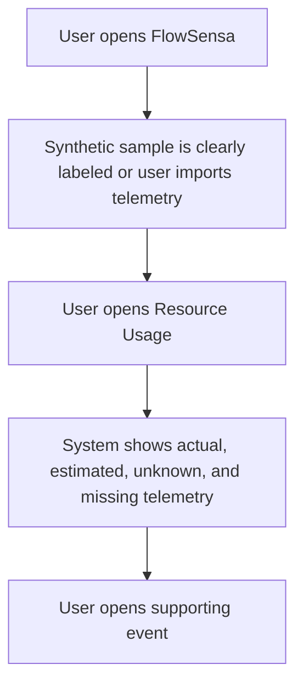

# Design: Resource Usage

> Requirements: @requirements.md
> Status: Approved

## 1. Summary

Add a deterministic Resource Usage module to FlowSensa. It aggregates event-level `resources` without model calls, separates actual telemetry from estimates, highlights missing LLM/resource coverage, and links rows back to evidence events. Strengthen synthetic sample labeling in the workspace header with a clear import action.

## 2. Requirements Mapping

| Requirement | Design Coverage |
|-------------|-----------------|
| FR-001 | Add `resources` route/view in `App.tsx` navigation and a `ResourceUsage` module. |
| FR-002 | Add `buildResourceUsage` domain aggregation over `WorkEvent.resources`. |
| FR-003 | Group measurement classes into actual, estimated, and unknown buckets; label UI totals. |
| FR-004 | Add model/tool and agent event coverage summaries, including missing resource telemetry. |
| FR-005 | Resource rows use existing `onOpenEvent` dialog pattern. |
| FR-006 | Not implemented in this slice; export remains future enhancement. |
| NFR-001 | Copy uses "Actual telemetry", "Estimated", "Unknown", and "Missing". |
| NFR-002 | All aggregation is local and deterministic. |
| NFR-003 | Single-pass event aggregation supports prototype-scale data. |
| NFR-004 | Use semantic tables/buttons and responsive existing table styles. |

## 3. Technical Approach

Create `src/domain/resourceUsage.ts` with pure aggregation functions and test coverage in `tests/domain.test.ts`. Add `src/modules/ResourceUsage.tsx` as a presentational module. Wire it into `App.tsx` with `useMemo`, navigation, and event-dialog drill-down.

## 4. Component / Module Structure

```text
src/domain/resourceUsage.ts
  buildResourceUsage(events, graph?)
src/modules/ResourceUsage.tsx
  summary cards
  model/tool coverage
  top task table
  case table
src/App.tsx
  navigation route
  synthetic sample banner/action
tests/domain.test.ts
  resource aggregation coverage
```

## 5. Data Model / State

No persistent schema change. The module consumes existing `WorkEvent.resources`, `system.model`, `system.tool`, `actor.type`, `caseId`, and graph node membership.

Actual telemetry means `measurementClass` is `metered`, `provider-reported`, or `allocated`. Estimated telemetry means `estimated`. Unknown telemetry means `unknown` or null-valued resources.

## 6. API / Integration Contract

No external API. No LLM provider call. No billing reconciliation.

## 7. Security / Permissions / Privacy

Resource aggregation runs in browser against imported or synchronized events. The UI must not send resource data anywhere.

## 8. User Flows



## 9. Edge Cases

| Case | Expected Behavior |
|------|-------------------|
| No resources | Show empty/missing coverage guidance. |
| Null resource value | Count as unknown, not as zero. |
| Multiple resource units | Keep units separate. |
| Agent event without resources | Flag as missing resource telemetry. |
| Synthetic sample | Banner says "Synthetic sample data loaded locally." |

## 10. Accessibility / UX Notes

Use existing data table patterns. Buttons that open events have explicit labels. Cards should be readable on mobile using existing responsive CSS.

## 11. Observability / Operations

Not applicable.

## 12. Migration / Rollout

No migration. Existing saved workspaces continue to load.

## 13. Technical Decisions

### TD-001: Deterministic local aggregation

- **Decision:** Aggregate resource usage in a pure domain module.
- **Why:** Keeps FlowSensa useful without a model key and aligns with local-first trust.
- **Trade-off:** No provider billing reconciliation.
- **Alternatives considered:** LLM-generated cost narrative; rejected because it could obscure evidence quality.

### TD-002: Strong sample-data banner

- **Decision:** Show a visible banner and action when the loaded workspace is synthetic.
- **Why:** Users should understand production starts with local demo data, not shared real data.
- **Trade-off:** Slightly more UI chrome in demo mode.
- **Alternatives considered:** Empty default workspace; rejected because demos feel inert.

## 14. Risks

| Risk | Impact | Mitigation |
|------|--------|------------|
| Users mistake estimates for facts | High | Separate estimated and actual buckets visibly. |
| Sparse telemetry looks like zero cost | Medium | Show missing coverage counts. |
| Sample data feels like real data | Medium | Strengthen header and banner copy. |

## 15. Verification Strategy

- Unit: resource aggregation for actual, estimated, missing, and model grouping.
- Build/lint: `npm run lint`, `npm test`, `npm run build`.
- Manual/browser: screenshot Resource Usage and sample banner.

## 16. Implementation FAQ

**Q:** Should estimates overwrite missing actual token usage?  
**A:** No. Estimates are separate from actual telemetry.

**Q:** Should the feature call the connected LLM?  
**A:** No. This is deterministic local analysis.
