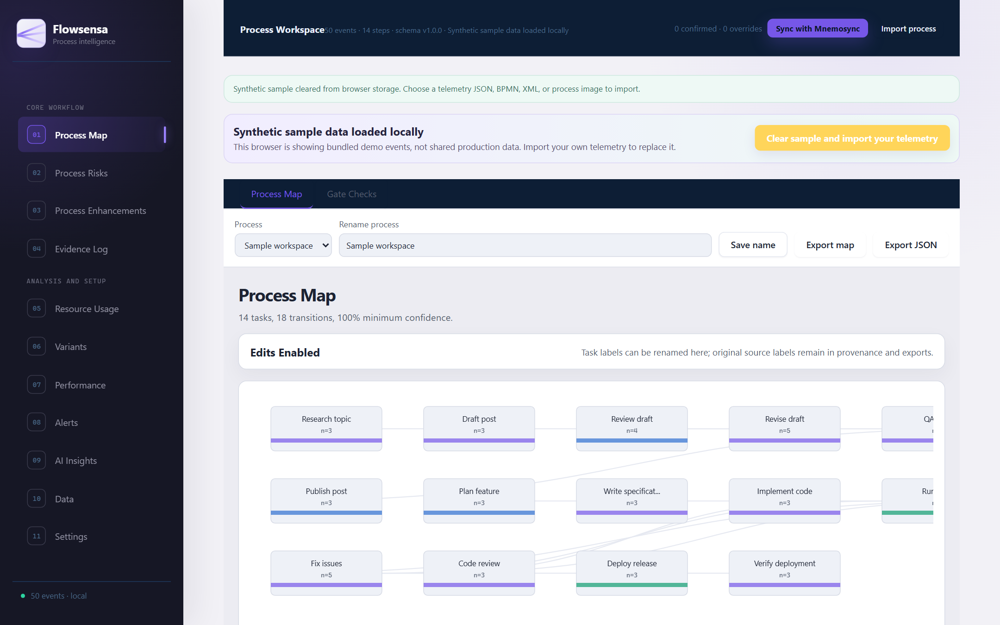

# FlowSensa

Turn work telemetry — from people, AI agents, and systems — into process maps, risks, and improvement suggestions you can check against evidence.

[**Live demo**](https://flowsensa.vercel.app) · [Telemetry guide](docs/telemetry-log-guide.md) · [Architecture](docs/architecture.md)

[](LICENSE)



## Features

- Process maps discovered from event logs, with confirmable steps and transitions
- Process risks and enhancement suggestions, each tied to the evidence behind them
- Resource usage, variants, and performance views across human, agent, and system work
- Deterministic process-mining core — no model key required
- Optional AI insights through your own OpenAI-compatible key (kept in memory, never stored)

## Quick start

```bash
npm install
npm run dev
```

Open http://localhost:5173 and click **Begin demo** to load a synthetic workspace — no key or data needed.

## Bring your own telemetry

Import FlowSensa JSON work events, BPMN/XML process models, or process images. Optional sync from FindMnemo (formerly Mnemosync) is supported but never required — JSON import/export is always the escape hatch. Event schema, examples, and prompts: [telemetry guide](docs/telemetry-log-guide.md).

## Privacy

- Workspace data stays in your browser unless you explicitly import, sync, or export.
- API keys live in session memory only — never in local storage, exports, or logs.

## License

[MIT](LICENSE)
