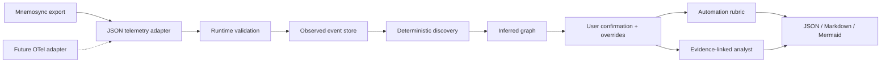

# Flowsensa architecture

Flowsensa is a consumer of the shared work-event contract.

## Boundaries

- Mnemosync owns capture and export.
- Flowsensa owns process reconstruction, confirmation, responsibility analysis,
  and automation recommendations.
- LocalCFO owns model usage, cost, and utility analysis in a separate project.
- Flowsensa never reads another application's local storage or database.
- Optional Elastic or OpenTelemetry infrastructure sits behind an adapter and
  is not bundled into the app.

## Truth model

Imported facts are observed. Reconstructed nodes and edges are inferred.
Explicit confirmation produces user-confirmed facts. Edits retain prior values
and rationale as overrides.

## Privacy

Imports and derived state remain in local IndexedDB. The application makes no
external model or analytics requests. Users can delete the workspace from the
sidebar.
